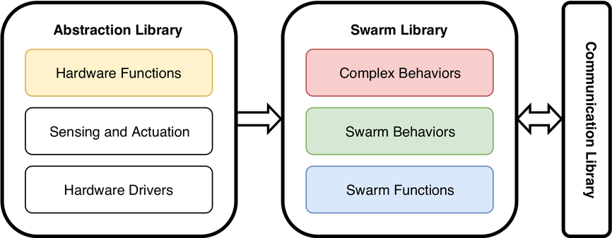

# Complex Behaviors Library
The complex behaviors library contains complex behaviors for swarms of cyber-physical systems (CPSs). The complex behaviors are defined by finite state machines (FSMs) where each state defines a behavior and transitions are triggered by events. Each state can either be
* another complex behavior from this library,
* a swarm algorithm from the [swarm behavior library](https://github.com/cpswarm/swarm_behaviors),
* a swarm function from the [swarm functions library](https://github.com/cpswarm/swarm_functions), or
* a hardware function from the [hardware functions library](https://github.com/cpswarm/hardware_functions).

The events that trigger behavior state changes can either originate locally, e.g., from sensor readings or behavior rules or remotely, e.g., from communication between CPSs, or from a command and control station.

The complex behaviors library is part of the [swarm library](https://github.com/topics/swarm-library).

## Getting Started
The behavior library is based on the latest ROS long-term support release [ROS Kinetic Kame](https://wiki.ros.org/kinetic/). Newer versions may also work.

To run complex behaviors of this library, the complete behavior library is required, including the swarm library and the abstraction library. The swarm library consists of the two additional sub-libraries:
* [swarm behaviors](https://github.com/cpswarm/swarm_behaviors)
* [swarm functions](https://github.com/cpswarm/swarm_functions)

The abstraction library consists of three sub-libraries:
* [hardware functions](https://github.com/cpswarm/hardware_functions)
* [sensing and actuation](https://github.com/cpswarm/sensing_actuation)
* hardware drivers

The communication between CPSs is based on the [CPSwarm Communication Library](https://github.com/cpswarm/swarmio).

Furthermore, the [cpswarm_msgs](https://github.com/cpswarm/cpswarm_msgs/) are required by most packages in this library.

For detailed usage instructions, please refer to the individual ROS packages in this repository.

## Contributing
Contributions are welcome. 

Please fork, make your changes, and submit a pull request. For major changes, please open an issue first and discuss it with the other authors.

## Affiliation
  
This work is supported by the European Commission through the [CPSwarm H2020 project](https://cpswarm.eu) under grant no. 731946.
