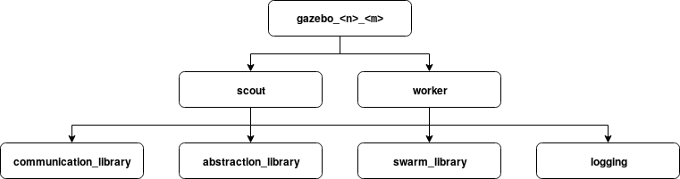

# cpswarm_storage
A package that performs box storage with a swarm of unmanned ground vehicles (UGVs). It is part of the complex behaviors library.

## Overview
To solve the box storage problem, a swarm of UGVs (the scouts) search an area for boxes. Once a box has been found, it is assigned to one of the worker UGVs. It then picks up the box and drops it at its assigned target location.

Storage is a complex behavior that is implemented by finite state machines (FSMs). Each state represents a behavior and transitions are triggered by events. This package contains the FSMs, the definition of events exchanged between UGVs, and launch files that allow to start simulations and perform real world missions.

## Dependencies
This package depends on the following message definitions:
* [move_base_msgs](https://wiki.ros.org/move_base_msgs)
* [cpswarm_msgs](https://cpswarm.github.io/cpswarm_msgs/html/index-msg.html)

The communication between UGVs is based on the [communication library](https://github.com/cpswarm/swarmio).

The following packages of the [swarm behaviors library](https://github.com/cpswarm/swarm_behaviors) are required:
* ugv_random_walk

The following packages of the [swarm functions library](https://github.com/cpswarm/swarm_functions/) are required:
* kinematics_exchanger
* target_monitor
* task_allocation

The following packages of the [hardware functions library](https://github.com/cpswarm/hardware_functions) are required:
* moveto

The following packages of the [sensing and actuation library](https://github.com/cpswarm/sensing_actuation) are required:
* area_provider
* navigation_pos_controller
* navigation_pos_provider
* navigation_vel_provider
* obstacle_detection

Further required packages are:
* [rospy](https://wiki.ros.org/rospy/)
* [stage_ros](https://wiki.ros.org/stage_ros/)
* [smach](https://wiki.ros.org/smach/)
* [smach_ros](https://wiki.ros.org/smach_ros/)
* [rosbag](https://wiki.ros.org/rosbag/) (only if `logging=true`)

## Execution
The behavior code can be executed either in simulation or deployed on the UGVs. There are several launch files that execute the behavior as well as the requirements. The launch files have a hierarchical include structure depicted in the figure below:



Each launch file has a set of parameters. They are inherited through the hierarchy of the launch files.

### Simulation
For simulation with the Stage simulator, execute the launch file
```
roslaunch cpswarm_storage stage.launch
```
It launches:
* `stage_ros/stageros`
  The Stage simulator.
* `sar/scout.launch`
  All required nodes to simulate the scout UGVs. It is launched `scouts` times.
* `sar/worker.launch`
  All required nodes to simulate the worker UGVs. It is launched `workers` times.

The following parameters allow to configure the simulation:
* `gui` (boolean, default: `false`)
  Whether to show the graphical user interface of the Stage simulator.
* `world` (string, default: `empty`)
  The world file to load into the Stage simulator. It defines the environment of the simulation.
* `scouts` (integer, default: `1`)
  The number of scout robots in the simulation. Minimum `1`, maximum `10`.
* `workers` (integer, default: `1`)
  The number of worker robots in the simulation. Minimum `1`, maximum `10`.
* `rng_seed` (integer, default: `0`)
  The seed used for random number generation. In the default case, a random seed is generated.

The `scout.launch` creates a distinct namespace `/$(arg vehicle)_$(arg id)`. It launches:
* `cpswarm_storage/scout_state_machine.py`
  The scout UGV behavior state machine.
* `cpswarm_storage/communication_library.launch`
  The communication library enabling communication between UGVs in the swarm.
* `cpswarm_storage/abstraction_library.launch`
  The abstraction library which launches the required nodes to access the hardware functionality.
* `cpswarm_storage/swarm_library.launch`
  The swarm algorithms and swarm functions required to perform the storage mission.
* `cpswarm_storage/logging.launch`
  A node for logging information about the mission. Only launched if `logging=true`.

The `worker.launch` creates a distinct namespace `/$(arg vehicle)_$(arg id)`. It launches:
* `cpswarm_storage/worker_state_machine.py`
  The worker UGV behavior state machine.
* `cpswarm_storage/communication_library.launch`
  The communication library enabling communication between UGVs in the swarm.
* `cpswarm_storage/abstraction_library.launch`
  The abstraction library which launches the required nodes to access the hardware functionality.
* `cpswarm_storage/swarm_library.launch`
  The swarm algorithms and swarm functions required to perform the storage mission.
* `cpswarm_storage/logging.launch`
  A node for logging information about the mission. Only launched if `logging=true`.

Both launch files can be configured with following parameters:
* `id` (integer, default: `0`)
  The identifier (ID) of the UGV in the swarm.
* `vehicle` (string, default: `iris`)
  The name of the UGV that is simulated. It is used to create the namespace.
* `x` (real, default: `0`)
  The starting position x-coordinate.
* `y` (real, default: `0`)
  The starting position y-coordinate.
* `world` (string, default: `empty`)
  The world file to be loaded by the map server when running simulations.
* `pos_type` (string, default: `local`)
  Whether relative (`local`) or GPS (`global`) coordinates are used.
* `simulation` (boolean, default: `false`)
  Whether the behavior is executed in simulation.
* `output` (string, default: `screen`)
  Whether to show the program output (`screen`) or to write it to a log file (`log`).
* `logging` (boolean, default: `false`)
  Whether to log data to bag files.

### Hardware
To run the code on deployed on hardware, directly execute the launch files for scouts
```
roslaunch scout.launch
```
and workers
```
roslaunch worker.launch
```

### Included Launch Files
In both cases, software simulations and hardware missions, there are several launch files included hierarchically.

#### communication_library.launch
The communication library enables communication between UGVs in the swarm. It launches:
* `swarmros/bridge`
  The communication library bridge that forwards topics between multiple ROS instances.

Parameters:
* `id` (integer, default: `0`)
  The identifier (ID) of the UGV in the swarm.
* `output` (string, default: `log`)
  Whether to show the program output (`screen`) or to write it to a log file (`log`).

#### abstraction_library.launch
The abstraction library launches the required nodes to access the hardware functionality. From the hardware functions library it launches:
* `moveto/moveto.launch`
  A node for moving the UGV to a given position.

From the sensing and actuation library it launches:
* `area_provider/area_provider.launch`
  Services regarding the mission area.
* `navigation_pos_controller/navigation_pos_controller.launch`
  A node for controlling the position of the UGV.
* `navigation_pos_provider/navigation_pos_provider_sim.launch`
  A node for retrieving the simulated position of the UGV. Only if `simulation=true`.
* `navigation_pos_provider/navigation_pos_provider.launch`
  A node for retrieving the position of the UGV. Only if `simulation=false`.
* `navigation_vel_provider/navigation_vel_provider.launch`
  A node for retrieving the velocity of the UGV.
* `obstacle_detection/obstacle_detection.launch`
  Services for detecting obstacles using different sources.

Parameters
* `id` (integer, default: `0`)
  The identifier (ID) of the UGV in the swarm.
* `frame` (string)
  The coordinate frame.
* `x` (real, default: `0`)
  The x-coordinate measured from the origin of the relative localization system.
* `y` (real, default: `0`)
  The y-coordinate measured from the origin of the relative localization system.
* `world` (string)
  The world file to be loaded by the map server when running simulations.
* `pos_type` (string, default: `local`)
  Whether relative (`local`) or GPS (`global`) coordinates are used.
* `simulation` (boolean, default: `false`)
  Whether the behavior is executed in simulation.
* `output` (string, default: `log`)
  Whether to show the program output (`screen`) or to write it to a log file (`log`).

#### swarm_library.launch
The swarm library launches the swarm algorithms and swarm functions required to perform the storage mission. It launches:
* `ugv_random_walk/ugv_random_walk.launch`
  A swarm algorithm performing random walk coverage.
* `kinematics_exchanger/kinematics_exchanger.launch`
  A node to exchange kinematic properties between UGVs.
* `target_monitor/target_monitor.launch`
  A node to monitor the location of targets.
* `task_allocation/task_allocation.launch`
  Nodes to assign tasks between UGVs.

Parameters:
* `id` (integer, default: `0`)
  The identifier (ID) of the UGV in the swarm.
* `output` (string, default: `log`)
  Whether to show the program output (`screen`) or to write it to a log file (`log`).

#### logging.launch
Logging of data. This launch file launches:
* `rosbag/record`
  A node for logging information about the mission from ROS topics to ROS bag files.

Parameters:
* `id` (integer, default: `0`)
  The identifier (ID) of the UGV in the swarm.
* `output` (string, default: `log`)
  Whether to show the program output (`screen`) or to write it to a log file (`log`).

## Scripts
There are several scripts contained in this package. First, they define the FSMs to be executed for the SAR mission. Second, there are scripts to analyze logged data from the SAR mission.

### scout_state_machine.py
This script launches the state machine of the scout UGVs for the storage mission.

### worker_state_machine.py
This script launches the state machine of the worker UGVs for the storage mission.

## Communication Library Configuration
The communication library configuration `param/swarmros.cfg` defines the data exchanged between the UGVs in the swarm and between the UGVs and the control station. This includes the events that trigger the FSM state changes. Refer to the [Communication Library](https://github.com/cpswarm/swarmio) documentation for more information.

## World Configuration
The world to be simulated is configured in the `world` directory. For the world name `<name>` specified by the launch files parameters, it must contain:
* `<name>.pgm`
  The floor plan of the world used by the map server.
* `<name>.png`
  The floor plan of the world used by the Stage simulator.
* `<name>.world`
  The world file describing the Stage simulation setup of the world.
* `<name>.yaml`
  Parameters for the map server.

Additionally, there is the `settings.inc` file which specifies the common properties such as the robot models to be used in the simulations.

For more information refer to the [Stage reference](https://codedocs.xyz/CodeFinder2/Stage/).
