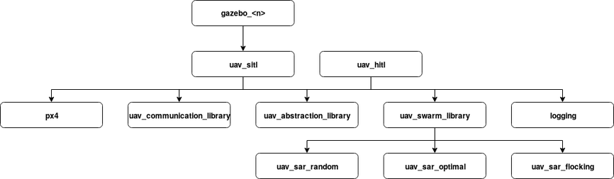

# sar

This package performs search and rescue (SAR) with a heterogeneous swarm of cyber physical systems (CPSs), i.e., unmanned aerial and ground vehicles (UAVs and UGVs). It is part of the complex behaviors library.

## Overview
SAR is a complex behavior that is implemented by finite state machines (FSMs). Each state represents a behavior and transitions are triggered by events. This package contains the FSMs, the definition of events exchanged between CPSs, and launch files that allow to start simulations and perform real world missions.

## Dependencies
This package depends on the following message definitions:
* [std_srvs](https://wiki.ros.org/std_srvs)
* [mavros_msgs](https://wiki.ros.org/mavros_msgs)
* [cpswarm_msgs](https://cpswarm.github.io/cpswarm_msgs/html/index-msg.html)

The communication between CPSs is based on the [CPSwarm Communication Library](https://github.com/cpswarm/swarmio).

The following packages of the [swarm behaviors library](https://github.com/cpswarm/swarm_behaviors) are required:
* uav_random_direction (only if `behavior=random`)
* uav_optimal_coverage (only if `behavior=optimal`)
* uav_flocking (only if `behavior=flocking`)
* uav_local_coverage
* uav_simple_tracking (unless `behavior=flocking`)

The following packages of the [swarm functions library](https://github.com/cpswarm/swarm_functions/) are required:
* area_division
* coverage_path
* kinematics_exchanger
* state_exchanger
* target_monitor
* task_allocation

The following packages of the [hardware functions library](https://github.com/cpswarm/hardware_functions) are required:
* uav_mavros_land
* uav_mavros_takeoff
* mission_aborter

The following packages of the [sensing and actuation library](https://github.com/cpswarm/sensing_actuation) are required:
* area_provider
* mavros_gps (only if `pos_type=global`)
* mavros_pos_controller
* mavros_pos_provider
* mavros_vel_controller
* mavros_vel_provider
* obstacle_detection

The following packages of the hardware drivers library are required for real world missions (if `obc=true`):
* obc_ros_openmv
* obc_ros_sonar
* obc_ros_uwb

Further required packages are:
* [rospy](https://wiki.ros.org/rospy/)
* [gazebo_ros](https://wiki.ros.org/gazebo_ros/)
* [mavros](https://wiki.ros.org/mavros/)
* [px4](https://px4.io/)
* [smach](https://wiki.ros.org/smach/)
* [smach_ros](https://wiki.ros.org/smach_ros/)
* [rosbag](https://wiki.ros.org/rosbag/) (only if `logging=true`)

## Execution
The behavior code can be executed either in simulation (SITL) or deployed on the CPSs (HITL). There are several launch files that execute the behavior as well as the requirements. The launch files have a hierarchical include structure depicted in the figure below:



Each launch file has a set of parameters. They are inherited through the hierarchy of the launch files.

### Simulation
For simulation with the Gazebo simulator, execute the launch file
```
roslaunch sar gazebo_<n>.launch
```
where `<n>` is the number of UAVs in the swarm to be simulated. It launches:
* `gazebo_ros/empty_world.launch`
  The Gazebo simulator.
* `sar/uav_sitl.launch`
  All required nodes to simulate the UAVs. It is launched `<n>` times.

The following parameters allow to configure the simulation:
* `gui` (boolean, default: `false`)
  Whether to show the graphical user interface of the Gazebo simulator.
* `world` (string, default: `$(find mavlink_sitl_gazebo)/worlds/empty.world`)
  The world file to load into the Gazebo simulator. It defines the environment of the simulation.
* `rng_seed` (integer, default: `0`)
  The seed used for random number generation. In the default case, a random seed is generated.

The `uav_sitl.lauch` creates a distinct namespace `/cpswarm/$(arg vehicle)_$(arg id)`. It launches:
* `sar/scripts/uav_sar_simulation.py`
  The UAV behavior state machine.
* `sar/px4.launch`
  The PX4 flight controller as SITL which will spawn a new UAV in the simulator.
* `mavros/px4.launch`
  The MAVROS node which connects to the simulated PX4 flight controller.
* `sar/uav_communication_library.launch`
  The communication library enabling communication between CPSs in the swarm.
* `sar/uav_abstraction_library.launch`
  The abstraction library which launches the required nodes to access the hardware functionality.
* `sar/uav_swarm_library.launch`
  The swarm algorithms and swarm functions required to perform the SAR mission.
* `sar/logging.launch`
  A node for logging information about the mission. Only launched if `logging=true`.

Parameters:
* `id` (integer, default: `1`)
  The identifier (ID) of the UAV in the swarm.
* `vehicle` (string, default: `iris`)
  The type of UAV that is simulated.
* `x` (real, default: `0`)
  The starting position x-coordinate.
* `y` (real, default: `0`)
  The starting position y-coordinate.
* `Y` (real, default: `0`)
  The starting position yaw angle.
* `pos_type` (string, default: `local`)
  Whether relative (`local`) or GPS (`global`) coordinates are used by the flight controller.
* `output` (string, default: `screen`)
  Whether to show the program output (`screen`) or to write it to a log file (`log`).
* `behavior` (string, default: `random`)
  The behavior of the UAV for SAR. It must correspond to one of the launch files `uav_sar_*.launch`.
* `logging` (boolean, default: `false`)
  Whether to log data to bag files.
* `udp_port_obc` (integer, default: `14540 + id`)
  The port number at which the simulated on board computer running MAVROS listens to incoming connections.
* `udp_port_fcu` (integer, default: `14550 + id`)
  The port number at which the simulated flight controller PX4 listens for incoming connections from the on board computer.
* `udp_port_sim` (integer, default: `14560 + id`)
  The port number which the simulated flight controller PX4 uses to communicate with the simulator.

### Hardware
To run the code on deployed on real hardware, execute the launch file
```
roslaunch uav_hitl.launch
```
It creates a distinct namespace `$(arg vehicle)_$(arg id)`. It launches:
* `sar/uav_sar_demonstration.py`
  The UAV behavior state machine.
* `mavros/px4.launch`
  The MAVROS node which connects to the PX4 flight controller.
* `sar/uav_communication_library.launch`
  The communication library enabling communication between CPSs in the swarm.
* `sar/uav_abstraction_library.launch`
  The abstraction library which launches the required nodes to access the hardware functionality.
* `sar/uav_swarm_library.launch`
  The swarm algorithms and swarm functions required to perform the SAR mission.
* `sar/logging.launch`
  A node for logging information about the mission. Only launched if `logging=true`.

Parameters:
* `id` (integer, default: `1`)
  The identifier (ID) of the UAV in the swarm.
* `vehicle` (string, default: `drone`)
  The type of the UAV that is executed. It is used to create the namespace.
* `x` (real, default: `0`)
  The x-coordinate measured from the origin of the relative localization system.
* `y` (real, default: `0`)
  The y-coordinate measured from the origin of the relative localization system.
* `pos_type (string, default: `local`)
  Whether relative (`local`) or GPS (`global`) coordinates are used by the flight controller.
* `output` (string, default: `screen`)
  Whether to show the program output (`screen`) or to write it to a log file (`log`).
* `behavior` (string, default: `random`)
  The behavior of the UAV for SAR. It must correspond to one of the launch files `uav_sar_*.launch`.
* `logging` (boolean, default: `true`)
  Whether to log data to bag files.
* `fcu_url` (string, default: `/dev/ttyS2:57600`)
  The path to the interface for communication with the flight controller.

### Included Launch Files
In both cases, software simulations and hardware missions, there are several launch files included hierarchically.

#### px4.launch
TODO: simulation only, check if still required

#### uav_communication_library.launch
The communication library enables communication between CPSs in the swarm. It launches:
* `swarmros/bridge`
  The communication library bridge that forwards topics between multiple ROS instances.

Parameters:
* `id` (integer, default: `1`)
  The identifier (ID) of the UAV in the swarm.
* `output` (string, default: `screen`)
  Whether to show the program output (`screen`) or to write it to a log file (`log`).

#### uav_abstraction_library.launch
The abstraction library launches the required nodes to access the hardware functionality. From the hardware functions library it launches:
* `mission_aborter/mission_aborter.launch`
  The mission aborter which stops a mission FSM with the respective event.
* `uav_mavros_land/mavros_land.launch`
  Land service for UAVs.
* `uav_mavros_takeoff/mavros_takeoff.launch`
  Launch service for UAVs.

From the sensing and actuation library it launches:
* `area_provider/area_provider.launch`
  Services regarding the mission area.
* `mavros_gps/mavros_gps.launch`
  Services to perform computations using GPS coordinates. Only launched if `pos_type=global`.
* `mavros_pos_controller/mavros_pos_controller.launch`
  A node for controlling the position of the UAV.
* `mavros_pos_provider/mavros_pos_provider.launch`
  A node for retrieving the position of the UAV.
* `mavros_vel_controller/mavros_vel_controller.launch`
  A node for controlling the velocity of the UAV.
* `mavros_vel_provider/mavros_vel_provider.launch`
  A node for retrieving the velocity of the UAV.
* `obstacle_detection/obstacle_detection.launch`
  Services for detecting obstacles using different sources.

From the hardware drivers library it launches for real world missions (if `obc=true`):
* `obc_ros_openmv/obc_ros_openmv.launch`
  A node for accessing an OpenMV camera.
* `obc_ros_sonar/obc_ros_sonar.launch`
  A node for accessing sonar sensors.
* `obc_ros_uwb/obc_ros_uwb.launch`
  A node for ultra wideband (UWB) localization.

Parameters
* `id` (integer, default: `1`)
  The identifier (ID) of the UAV in the swarm.
* `x` (real, default: `0`)
  The x-coordinate measured from the origin of the relative localization system.
* `y` (real, default: `0`)
  The y-coordinate measured from the origin of the relative localization system.
* `pos_type (string, default: `local`)
  Whether relative (`local`) or GPS (`global`) coordinates are used by the flight controller.
* `obc` (boolean, default: `false`)
  Whether the code is executed on the onboard computer (OBC) of the UAV.
* `output` (string, default: `screen`)
  Whether to show the program output (`screen`) or to write it to a log file (`log`).

#### uav_swarm_library.launch
The swarm library launches the swarm algorithms and swarm functions required to perform the SAR mission. It launches:
* `sar/uav_sar_<behavior>.launch`
  The swarm algorithms from the swarm behaviors library.
* `area_division/area_division.launch`
  A node to divide the mission area among CPSs.
* `coverage_path/coverage_path.launch`
  A node to compute a coverage path for a given area.
* `kinematics_exchanger/kinematics_exchanger.launch`
  A node to exchange kinematic properties between CPSs.
* `state_exchanger/state_exchanger.launch`
  A node to exchange the behavior state between CPSs.
* `target_monitor/target_monitor.launch`
  A node to monitor the location of targets.
* `task_allocation/task_allocation.launch`
  Nodes to assign tasks between CPSs.

Parameters:
* `id` (integer, default: `1`)
  The identifier (ID) of the UAV in the swarm.
* `output` (string, default: `screen`)
  Whether to show the program output (`screen`) or to write it to a log file (`log`).
* `behavior` (string, default: `random`)
  The behavior of the UAV for SAR. It must correspond to one of the launch files `uav_sar_*.launch`.

##### uav_sar_random.launch
Swarm algorithms to perform coverage and tracking for SAR performing random movement. It launches:
* `uav_random_direction/uav_random_direction.launch`
  A random direction coverage algorithm.
* `uav_local_coverage/uav_local_coverage.launch`
  A local coverage algorithm.
* `uav_simple_tracking/uav_simple_tracking.launch`
  A tracking algorithm that moves the UAV over the target.

Parameters:
* `id` (integer, default: `1`)
  The identifier (ID) of the UAV in the swarm.
* `output` (string, default: `screen`)
  Whether to show the program output (`screen`) or to write it to a log file (`log`).

##### uav_sar_optimal.launch
Swarm algorithms to perform coverage and tracking for SAR performing random movement. It launches:
* `uav_optimal_coverage/uav_optimal_coverage.launch`
  An optimal coverage algorithm.
* `uav_local_coverage/uav_local_coverage.launch`
  A local coverage algorithm.
* `uav_simple_tracking/uav_simple_tracking.launch`
  A tracking algorithm that moves the UAV over the target.

Parameters:
* `id` (integer, default: `1`)
  The identifier (ID) of the UAV in the swarm.
* `output` (string, default: `screen`)
  Whether to show the program output (`screen`) or to write it to a log file (`log`).

##### uav_sar_flocking.launch
Swarm algorithms to perform coverage and tracking for SAR performing random movement. This launch file launches:
* `uav_flocking/uav_flocking_coverage.launch`
  A flocking based coverage algorithm.
* `uav_local_coverage/uav_local_coverage.launch`
  A local coverage algorithm.
* `uav_flocking/uav_flocking_tracking.launch`
  A flocking based tracking algorithm.

Parameters:
* `id` (integer, default: `1`)
  The identifier (ID) of the UAV in the swarm.
* `output` (string, default: `screen`)
  Whether to show the program output (`screen`) or to write it to a log file (`log`).

#### logging.launch
Logging of data. This launch file launches:
* `rosbag/record`
  A node for logging information about the mission from ROS topics to ROS bag files.

Parameters:
* `id` (integer, default: `1`)
  The identifier (ID) of the UAV in the swarm.
* `output` (string, default: `screen`)
  Whether to show the program output (`screen`) or to write it to a log file (`log`).

## Scripts
There are several scripts contained in this package. First, they define the FSMs to be executed for the SAR mission. Second, there are scripts to analyze logged data from the SAR mission.

### uav_sar_simulation.py
This script launches the state machine of the UAVs for the simulated SAR mission.

### uav_sar_demonstration.py
This script launches the state machine of the UAVs for real world SAR missions.

### uav_coverage_simulation.py
This script launches multiple runs of the SAR simulation in order to collect statistical data.

Usage:
```
uav_coverage_simulation.py [-h] [-f F] [-l L] [-m M] [-r R] [-t T] dir
```

Positional arguments:
* `dir` (string)
  Directory containing the ROS log files.

Optional arguments:
* `-h, --help`
  Show help message and exit.
* `-f F, --fails F` (integer, default: `10`)
  Maximum number of failure notices read from the log files before terminating the run.
* `-l L, --launch_file L` (string, default: `gazebo_2`)
  Name of the launch file from the sar package which is executed.
* `-m M, --max_time M` (integer, default: `3600`)
  Maximum time in seconds that one simulation run is allowed to take.
* `-r R, --runs R` (integer, default: `1`)
  Number of runs to perform.
* `-t T, --timeout T` (integer, default: `60`)
  Maximum time in seconds that one robot is allowed to do nothing before terminating the run.

### uav_sar_analysis.py
This script analyzes ROS bag files of the SAR in terms of area covered over time.

Usage:
```
uav_sar_analysis.py [-h] [-a] [--conf C] [-d] [--fov F] [-l L] [--name_space N] [-o] [--percentages P] [--prefix P] [-r R] [-s S] [--sar_package P] [--suffix U] [-t] [-v] [--yaml_package P] [--yaml_file Y] input
```

Positional arguments:
* `input`
  Folder containing the bag files.

Optional arguments:
* `-h, --help`
  Show help message and exit.
* `-a, --aggregate` (boolean, default: `False`)
  Aggregate the data of multiple runs.
* `--conf C` (real, default: `0.9`)
  Confidence for plotting error bars (only in combination with `-a`).
* `-d, --display` (boolean, default: `False`)
  Display figures visualizing the results.
* `--fov F` (real, default: `0.64`)
  The field of view of the UAVs in radian.
* `-l L, --launch_file L` (string, default: `gazebo`)
  Prefix of the launch file name which specifies the starting coordinates of the `N` UAVs (format `<L>_<N>.launch`).
* `--name_space N` (string, default: ``)
  Name space of the messages in the bag files (e.g. `/drone1/`), required for hardware bag files.
* `-o, --output` (boolean, default: `False`)
  Output the results in a text file in the PWD.
* `--percentages P` (real list, default: `[0.5, 0.75, 0.875, 0.9375, 0.96875, 1]`)
  The percentages of covered area to calculate the time for (only in combination with `-t`).
* `--prefix P` (string, default: `sar`)
  Prefix of the bag files.
* `-r R, --res_time R` (integer, default: `1000`)
  The time resolution of the output data in seconds (not in combination with `-t`).
* `-s S, --res_space S` (real, default: `0.1`)
  The spatial resolution in meter to filter the input data by (minimum distance between two consecutive coordinates).
* `--sar_package P` (string, default: `sar`)
  Package that contains the launch file which specifies the starting coordinates of the UAVs.
* `--suffix U` (string, default: `.bag`)
  Suffix of the bag files.
* `-t, --times` (boolean, default: `False`)
  Output result are times to reach certain percentages of covered area as opposed to the progress of covered area over time.
* `-v, --verbose` (boolean, default: `False`)
  Be verbose.
* `--yaml_package P` (string, default: `area_provider`)
  Package that contains the yaml param file which specifies the coordinates of the environment.
* `--yaml_file Y` (string, default: `area_provider`)
  Name of the yaml param file which specifies the coordinates of the environment.

### uav_coverage_analysis.py
This script analyzes ROS bag files of the SAR coverage in terms of area covered over time.

Usage:
```
uav_coverage_analysis.py [-h] [-a] [--conf C] [-d] [--fov F]  [-l L] [--name_space N] [-o] [--percentages P] [--prefix P] [-r R] [-s S] [--sar_package P] [--suffix U] [-t] [-v] [--yaml_package P] [--yaml_file Y] input
```

Positional arguments:
* `input`
  Folder containing the bag files.

Optional arguments:
* `-h, --help`
  Show help message and exit.
* `-a, --aggregate` (boolean, default: `False`)
  Aggregate the data of multiple runs.
* `--conf C` (real, default: `0.9`)
  Confidence for plotting error bars (only in combination with `-a`).
* `-d, --display` (boolean, default: `False`)
  Display figures visualizing the results.
* `--fov F` (real, default: `0.64`)
  The field of view of the UAVs in radian.
* `-l L, --launch_file L` (string, default: `gazebo`)
  Prefix of the launch file name which specifies the starting coordinates of the `N` UAVs (format `<L>_<N>.launch`).
* `--name_space N` (string, default: ``)
  Name space of the messages in the bag files (e.g. `/drone1/`), required for hardware bag files.
* `-o, --output` (boolean, default: `False`)
  Output the results in a text file in the PWD.
* `--percentages P` (real list, default: `[0.5, 0.75, 0.875, 0.9375, 0.96875, 1]`)
  The percentages of covered area to calculate the time for (only in combination with `-t`).
* `--prefix P` (string, default: `sar`)
  Prefix of the bag files.
* `-r R, --res_time R` (integer, default: `1000`)
  The time resolution of the output data in seconds (not in combination with `-t`).
* `-s S, --res_space S` (real, default: `0.1`)
  The spatial resolution in meter to filter the input data by (minimum distance between two consecutive coordinates).
* `--sar_package P` (string, default: `sar`)
  Package that contains the launch file which specifies the starting coordinates of the UAVs.
* `--suffix U` (string, default: `.bag`)
  Suffix of the bag files.
* `-t, --times` (boolean, default: `False`)
  Output result are times to reach certain percentages of covered area as opposed to the progress of covered area over time.
* `-v, --verbose` (boolean, default: `False`)
  Be verbose.
* `--yaml_package P` (string, default: `area_provider`)
  Package that contains the yaml param file which specifies the coordinates of the environment.
* `--yaml_file Y` (string, default: `area_provider`)
  Name of the yaml param file which specifies the coordinates of the environment.

## Communication Library Configuration
The communication library configuration `param/uav_swarmros.cfg` defines the data exchanged between the CPS in the swarm and between the CPSs and the ground control station. This includes the events that trigger the FSM state changes. Refer to the [Communication Library](https://github.com/cpswarm/swarmio) documentation for more information.
